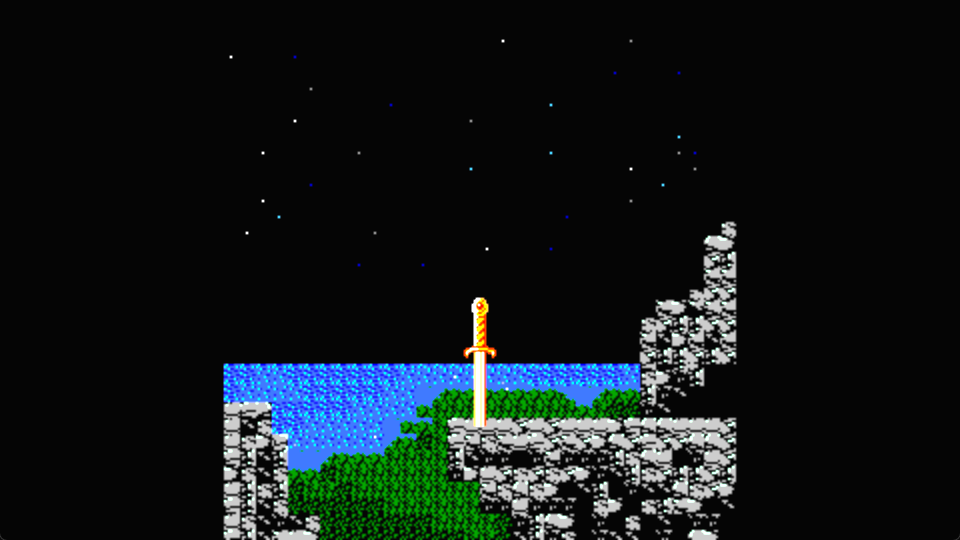
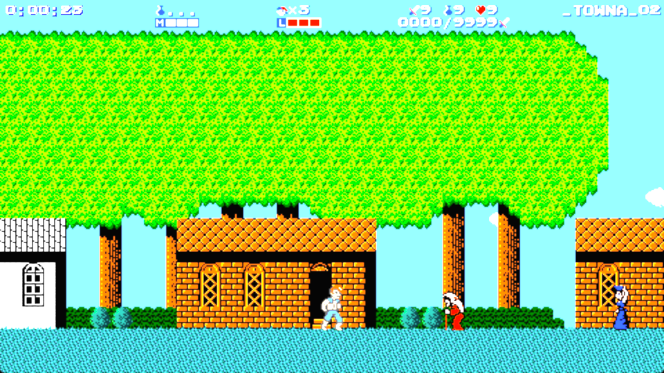
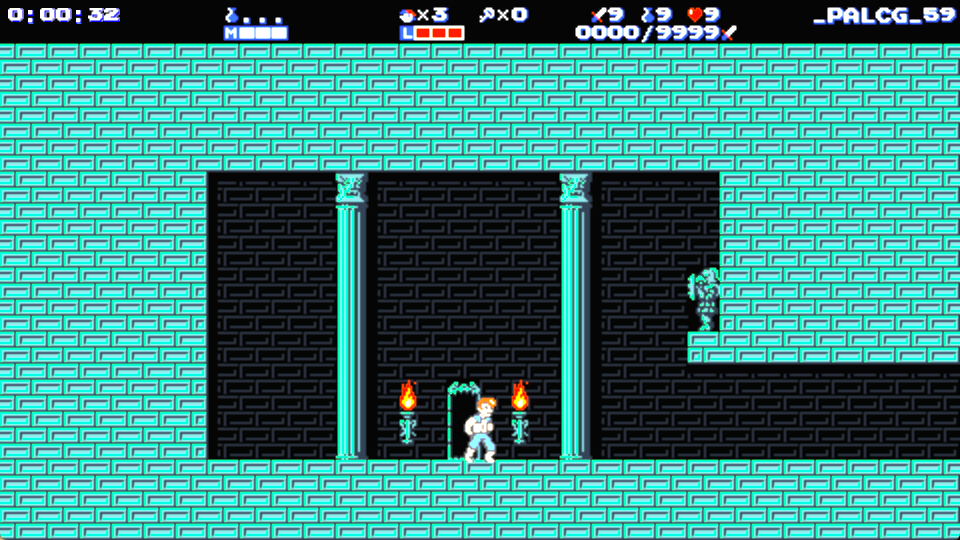
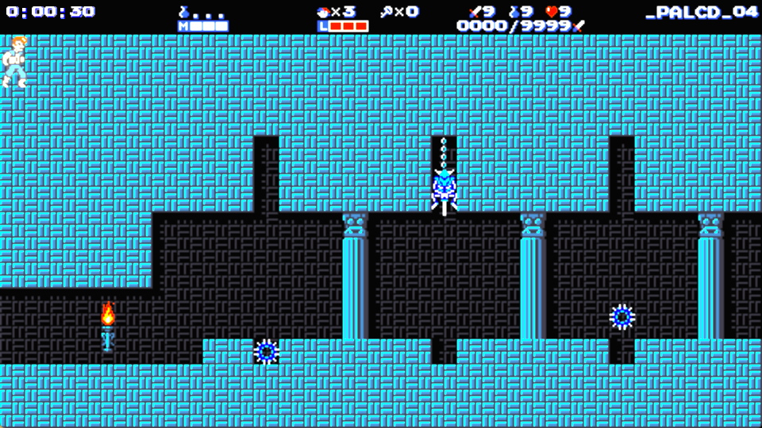
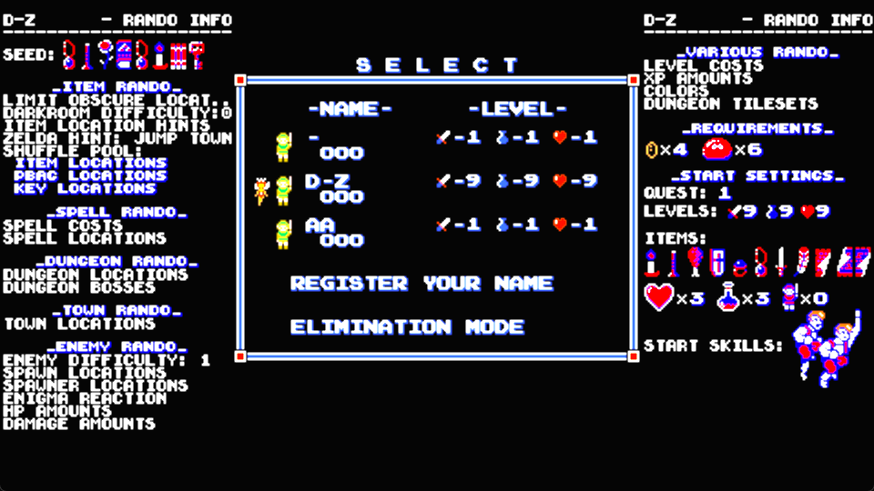

# ZALiA — GameMaker 2026 Port

An **unofficial fork** of [**ZALiA** (*Zelda Again: Link is Adventuresome*)](https://github.com/ZA-LiA/ZALiA),
a *Zelda II: The Adventure of Link* fan game by **HoverBat**.

This fork ports the original GameMaker:Studio 1.4 project to **GameMaker LTS 2026**
and adds features on top of it. It is **not** official, and **not** endorsed by or
affiliated with HoverBat, Nintendo, or the ZALiA project.

For the original game and its official builds, go to the upstream repository above.

**Version 2.0** — based on upstream ZALiA 1.7.12.02.

---

## Download

Grab the latest build from the [**Releases**](../../releases) page and unzip it
anywhere. Run `ZALiA.exe`. No installer, no dependencies.

Windows only. Saves and settings are written to `%LOCALAPPDATA%\ZALiA\` — the
folder you unzip to stays untouched, so you can move or replace the game without
losing progress.

**New here?** Read the **[Instruction Manual](MANUAL.md)** — controls, spells,
items, palaces, and how the randomizer works.

---

## What this port adds

| | |
|---|---|
| **Randomizer** | items, spells, town locations, palace layouts, enemy spawns, with in-game hints |
| **Stream tracker** | a browser page sized for OBS — every item, spell, container and key, in five themes |
| **Twitch integration** | chat can trigger in-game effects, including stealing your items |
| **Jukebox** | browse and play every track in the game; order, shuffle or repeat |
| **2-player co-op** | a second player joins as a fairy helper |
| **Display options** | smooth / sharp / pixel-perfect / crisp-fill / CRT / scanlines, fullscreen, window scale |
| **Controllers** | full gamepad support, calibration wizard, rebindable controls |
| **Quality of life** | low-HP beep, death counter, hint-NPC map markers, boulder compass labels |

---

## Screens

| | |
|---|---|
|  |  |
| A town in Western Hyrule | The Great Palace |
|  |  |
| A palace with randomized dungeon tilesets | Per-seed randomizer settings, shown at file select |

---

## Companion pages

The game runs a small web server on `127.0.0.1:8777` and serves its own companion
pages. **Loopback only** — it is not reachable from your network, and nothing is
sent anywhere.

Open them from **OPTIONS → COMPANION PAGES**, or point a browser at:

| Page | Address |
|---|---|
| Tracker | `http://127.0.0.1:8777/tracker` |
| Jukebox | `http://127.0.0.1:8777/jukebox` |
| Twitch setup | `http://127.0.0.1:8777/twitch` |

### Using the tracker in OBS

Add a **Browser Source**, set the URL to `http://127.0.0.1:8777/tracker?obs=1`,
and size it around **460 px wide**. `?obs=1` drops the page background so it
composites over gameplay. Add `&theme=NAME` to pick a theme.

---

## Twitch chat commands

Open the Twitch setup page, sign in on twitch.tv when prompted, and turn
**CHAT COMMANDS** on. Your token is stored locally in `%LOCALAPPDATA%\ZALiA\` and
is never displayed or transmitted anywhere else.

Viewers type commands in your chat to affect your run — healing, hindering, or
stealing an item and giving it back a while later. Effect duration and cooldown
are configurable on the setup page.

---

## Dev mode

The game ships with its development tools present but **switched off**, so players
cannot wander into a palette editor or a room sweep by accident.

To turn them on, either:

- enter **B B A A UP DOWN UP DOWN** on the title screen (that session only), or
- create an empty file named `dev_unlock.txt` in `%LOCALAPPDATA%\ZALiA\`
  (permanent, until you delete it)

Delete the file to switch them back off. Dev mode is unsupported — it exists for
debugging, and it is entirely possible to break your own save with it.

---

## Credits

### The game

**[HoverBat](https://github.com/ZA-LiA/ZALiA)** — creator of ZALiA. All of the
original design, code, and the GML translation of *Zelda II*'s assembly are his
work. This port would not exist without it. See [LICENSE](LICENSE).

### This port

- **GAINEY** — GameMaker 2026 port, additional features
- **LANEAGE** — design ideas and playtesting

### Built with

- **GameMaker Studio** — YoYo Games
- **Tiled Map Editor** — Thorbjørn Lindeijer
- **Palette Swapper** — [Pixelated Pope](https://github.com/PixelatedPope)
- **GMSched** — [Skyfloogle](https://github.com/Skyfloogle)

### Music and sound

- **BroomieTunes**
- **Isabelle Chiming** — VRC6 OST
- **Nikos8BitStereo** — NikoTengoku
- **Wyng** — orchestral soundtrack
- **Koji Kondo** — original *Zelda* audio

Additional arrangements included in this port are the work of their respective
composers and arrangers. Original *Zelda II* and *Super Mario Bros.* compositions
are by **Akito Nakatsuka** and **Koji Kondo** for Nintendo.

### Sprite work

Item and HUD sprites used by the companion tracker are ripped from the original
*Zelda II* by **Mister Mike**, via
[The Spriters Resource](https://www.spriters-resource.com/nes/). ZALiA-specific
item sprites were exported from the game's own palette shader.

### Patrons

WOLFZEN SKIIGH · WOLFZEN 'XIB' SKIIGH · CAPTAIN BOZO · GUARDIAN · BLACKMAGE14 ·
X570 BELMONT · TECHTONIC IMPROV · ROBIN AM · KOEBI · FLUFFY TAIL · REINEKE ·
JERBERJER · DRALKKIN · JACOB THE MOO · ATOMIC DRACULA · AARON · ZABII · DOW_PY72O

### Special thanks

PATRICK · ERIN · VINNY · SCHMIDTTYGAMES · TRAILZ · ALTERNA4091 · SOPHILAUTIA · cumqueefador

### Original *Zelda II: The Adventure of Link* staff — Nintendo, 1987

**Director** Tadashi Sugiyama, Yasuhisa Yamamura ·
**Designer** Kazunobu Shimizu ·
**Sound** Akito Nakatsuka ·
**Programmers** Kazuaki Morita, Tatsuo Nishiyama, Shigehiro Kasamatsu,
Yasunari Nishida, Toshihiko Nakago

All of the above are preserved in the in-game ending credits.

---

## License

The original code is HoverBat's and is redistributed under the terms in
[LICENSE](LICENSE), which are preserved unchanged.

*Zelda II: The Adventure of Link* and all related characters, names and marks are
trademarks of **Nintendo**. This is a non-commercial fan project, is not affiliated
with or endorsed by Nintendo, and is not sold. No Nintendo ROM is included or
required.
